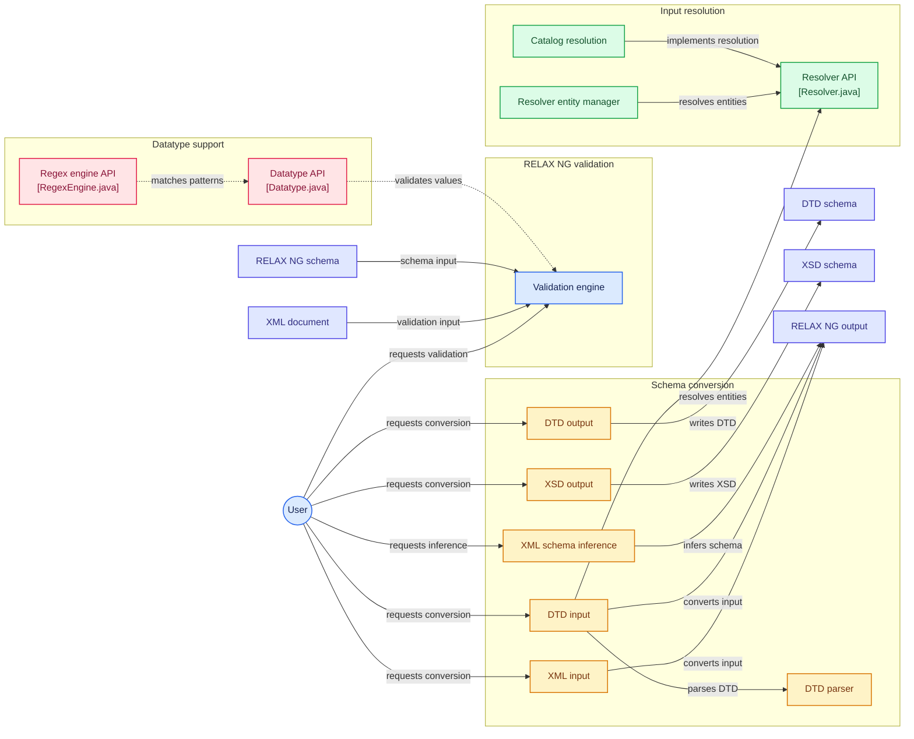

# Architecture Overview jing-trang

```mermaid
flowchart LR

    subgraph group_validation["RELAX NG validation"]
        node_validationengine["Validation engine"]
    end

    subgraph group_conversion["Schema conversion"]
        node_dtdinput["DTD input"]
        node_xmlinput["XML input"]
        node_dtdparse["DTD parser"]
        node_dtdoutput["DTD output"]
        node_xsdoutput["XSD output"]
        node_infer["XML schema inference"]
    end

    subgraph group_resolution["Input resolution"]
        node_resolver["Resolver API<br/>[Resolver.java]"]
        node_entitymanager["Resolver entity manager"]
        node_catalog["Catalog resolution"]
    end

    subgraph group_support["Datatype support"]
        node_datatypeapi["Datatype API<br/>[Datatype.java]"]
        node_regexapi["Regex engine API<br/>[RegexEngine.java]"]
    end

    node_user(("User"))
    node_xml["XML document"]
    node_rngschema["RELAX NG schema"]
    node_dtdresult["DTD schema"]
    node_xsdresult["XSD schema"]
    node_rngresult["RELAX NG output"]

    node_user -->|"requests validation"| node_validationengine
    node_xml -->|"validation input"| node_validationengine
    node_rngschema -->|"schema input"| node_validationengine
    node_user -->|"requests conversion"| node_dtdinput
    node_user -->|"requests conversion"| node_xmlinput
    node_user -->|"requests conversion"| node_dtdoutput
    node_user -->|"requests conversion"| node_xsdoutput
    node_user -->|"requests inference"| node_infer
    node_dtdinput -->|"parses DTD"| node_dtdparse
    node_dtdinput -->|"resolves entities"| node_resolver
    node_entitymanager -->|"resolves entities"| node_resolver
    node_catalog -->|"implements resolution"| node_resolver
    node_dtdoutput -->|"writes DTD"| node_dtdresult
    node_xsdoutput -->|"writes XSD"| node_xsdresult
    node_xmlinput -->|"converts input"| node_rngresult
    node_dtdinput -->|"converts input"| node_rngresult
    node_infer -->|"infers schema"| node_rngresult
    node_datatypeapi -.->|"validates values"| node_validationengine
    node_regexapi -.->|"matches patterns"| node_datatypeapi

    click node_validationengine "https://github.com/jurgenei/jing-trang/blob/master/src/main/legacy/mod/rng-validate/src/main/com/thaiopensource/relaxng/util/ValidationEngine.java"
    click node_dtdinput "https://github.com/jurgenei/jing-trang/tree/master/src/main/legacy/mod/convert-from-dtd/src/main/com/thaiopensource/relaxng/input/dtd"
    click node_xmlinput "https://github.com/jurgenei/jing-trang/tree/master/src/main/legacy/mod/convert-from-xml/src/main/com/thaiopensource/relaxng/input/xml"
    click node_dtdparse "https://github.com/jurgenei/jing-trang/tree/master/src/main/legacy/mod/dtd-parse/src/main/com/thaiopensource/xml/dtd"
    click node_dtdoutput "https://github.com/jurgenei/jing-trang/tree/master/src/main/legacy/mod/convert-to-dtd/src/main/com/thaiopensource/relaxng/output/dtd"
    click node_xsdoutput "https://github.com/jurgenei/jing-trang/tree/master/src/main/legacy/mod/convert-to-xsd/src/main/com/thaiopensource/relaxng/output/xsd"
    click node_resolver "https://github.com/jurgenei/jing-trang/blob/master/resolver/src/main/java/com/thaiopensource/resolver/Resolver.java"
    click node_entitymanager "https://github.com/jurgenei/jing-trang/blob/master/src/main/legacy/mod/dtd-parse/src/main/com/thaiopensource/xml/em/ResolverUriEntityManager.java"
    click node_catalog "https://github.com/jurgenei/jing-trang/blob/master/src/main/legacy/mod/catalog/src/main/com/thaiopensource/resolver/catalog/CatalogResolver.java"
    click node_datatypeapi "https://github.com/jurgenei/jing-trang/blob/master/datatype/src/main/java/org/relaxng/datatype/Datatype.java"
    click node_regexapi "https://github.com/jurgenei/jing-trang/blob/master/regex/src/main/java/com/thaiopensource/datatype/xsd/regex/RegexEngine.java"
    click node_infer "https://github.com/jurgenei/jing-trang/blob/master/src/main/legacy/mod/infer/src/main/com/thaiopensource/xml/infer/ContentModelInferrer.java"

    classDef toneNeutral fill:#f8fafc,stroke:#334155,stroke-width:1.5px,color:#0f172a
    classDef toneBlue fill:#dbeafe,stroke:#2563eb,stroke-width:1.5px,color:#172554
    classDef toneAmber fill:#fef3c7,stroke:#d97706,stroke-width:1.5px,color:#78350f
    classDef toneMint fill:#dcfce7,stroke:#16a34a,stroke-width:1.5px,color:#14532d
    classDef toneRose fill:#ffe4e6,stroke:#e11d48,stroke-width:1.5px,color:#881337
    classDef toneIndigo fill:#e0e7ff,stroke:#4f46e5,stroke-width:1.5px,color:#312e81
    classDef toneTeal fill:#ccfbf1,stroke:#0f766e,stroke-width:1.5px,color:#134e4a
    class node_validationengine,node_user toneBlue
    class node_dtdinput,node_xmlinput,node_dtdparse,node_dtdoutput,node_xsdoutput,node_infer toneAmber
    class node_resolver,node_entitymanager,node_catalog toneMint
    class node_datatypeapi,node_regexapi toneRose
    class node_xml,node_rngschema,node_dtdresult,node_xsdresult,node_rngresult toneIndigo
```